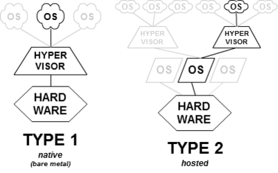

\newpage

# The virtualisation

The concept of virtualisation itself is hard to define as it is subject to many
different interpretations &ndash; or at least different levels of application.
In fact, even the way the different malware-auditing sandboxes work is often
distinctive from one another. Moreover, the term of virtualisation sometimes
hides something else (isolation, containerization, emulation...) and can be
misleading. If we will be focused on the virtualisation of processes in this
paper, it must be acknowledged that everything can be virtualized, from the
storage to the networks.

## Isolation

This is an old concept on Linux-based systems which has more recently appeared
on Windows 10 (1803) . It is not really a virtualisation but more of a way of
running a process in an independent environment that we call *context*. The
isolated process access and system calls are filtered so that it is not aware
of the host he's running on. This is basically the way containers work (LXC,
Docker), excepted on Windows which also provides a per-process virtualisation based
on Hyper-V, its own Type-1 virtualisation system (see below).

In more technical terms, the isolation of processes rests on kernel-level
features like *cgroups* (isolation of material resources: RAM, CPU...),
*chroot* (change the *root* &ndash; or **/** &ndash; directory), *namespaces*
(partitioning of kernel resources) on Linux. Such functionalities also exist
on Windows environment but with other names.

## Kernel in user-space

Just like the isolation, it is hard to call this virtualisation as it does not
virtualize the hardware. This is mostly used in kernel development, allowing
one to run the kernel above its own operating system like any other program. It
is not really used in other contexts so we will not elaborate.

## Type-2 hypervisor

An hypervisor is a platform that creates and runs virtual machines. We talk 
about type-2 or hosted hypervisors when the software runs above an operating
system (*VirtualBox*, *VMWare Workstation*, *Parallel Desktop*, *QEMU*...). 
This is often the solution chosen by the average users as it allows them to run
different operating systems on their day-to-day computer. But in this category
we have to make the distinction between the hardware virtualisation and the
software that we will call emulation.

In the first case, the virtualisation is supported directly by the hardware,
thanks to specific CPU instructions. Those technologies (*Intel VT* for the
blues and AMD-V for the reds) allow the hypervisor to delegate the memory and
CPU management to the hardware itself, thus simplifying the software
virtualisation. But this is only possible when you virtualize a machine with
the same architecture than the host: an x86_64 guest on a x86_64 host for 
instance.

The emulation, on the other hand, is required when the CPU does not support
virtualisation assistance or when you run another architecture (like ARM when
virtualizing an Android device). This time, the host has to simulate the whole
hardware on which the guest is supposed to be running and thus translate each
system call. The type-2 is already the slower way of virtualizing a system, but
it is even truer with emulation as this is an inefficient process by definition.

## Type-1 hypervisor

Type-1 or bare-metal hypervisors are the closest to the hardware. In this 
situation, the hypervisor runs directly on the machine and serves as a
lightweight operating system (*VMWare vSphere*, *Citrix Xen Server*, 
*Microsoft Hyper-V*...). This is way more efficient than the type-2
because you do not have an host OS that would consume resources. This kind of 
infrastructure is mostly used in data centers to simplify the deployment of
virtual machines and their performance. 

Note that this is not incompatible with the fact of running an operating system 
on the host machine: *Hyper-V* can be run from Windows 10 Pro for instance,
allowing good virtualisation performance and still having a user-friendly OS.